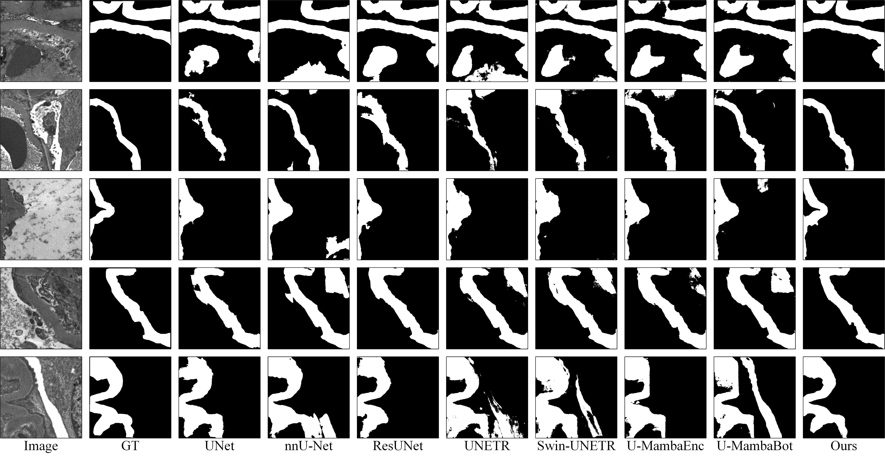

# EDC-Umamba
EDC-Umamba: Enhancing Directional Scanning U-Shaped Mamba  Network for Glomerular Basement Membrane  Segmentation and Quantification

## Overview

##  Description
In chronic kidney disease (CKD), assessing the thickness of glomerular basement membrane (GBM) using transmission electron microscopy (TEM) is crucial. However, current evaluations by pathologists rely on qualitative analysis, leading to intra-class variability due to differences in experience. In this paper, we propose an Enhanced Directional Scanning U-Shaped Mamba Network (EDC-Umamba) to efficiently segment the GBM, which could aid in predicting the progression of membranous nephropathy. In the segmentation structure, the proposed Mamba-based block enhances the ability to extract spatial features from complex images by combining a four-directional scanning strategy with window transformation operations. Additionally, we propose a thickness measurement method based on the segmentation mask, which integrates the quantified thickness and clinical indicators to construct a disease prediction model. Experiments demonstrate that our framework achieves superior segmentation performance compared to state-of-the-art methods, reducing false positives and providing more accurate delineation of the GBM's blurred boundaries. Clinical validation further confirms the effectiveness of the quantified pathological indicators in disease prediction. In summary, the proposed method effectively automates the segmentation and quantification of GBM thickness, showing promise for clinical applications in assisting pathologists with disease diagnosis.

## Setup 
- Cuda 12.1
- Python 3.9.18
- PyTorch 2.0.0

## Result

## TODO
- [ ] The code will be published after the paper is accepted.

## Data available
Due to medical ethics issues, our data will be conditionally disclosed after a public ethical review. Interested parties will request permission to access the data by emailing the address: blessingoasis@outlook.com.
